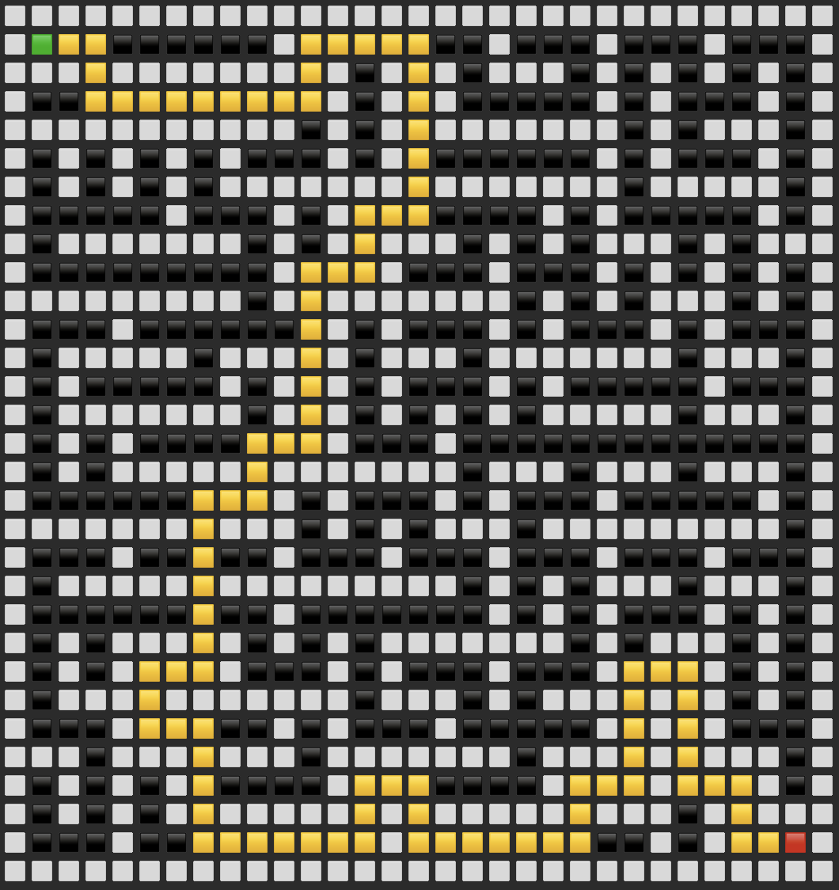

# Академия Бэкенда 

Приветствую тебя, странник!

В этом репозитории собраны результаты обучения на курсе [Т-банк "Академия Бэкенда"](https://education.tbank.ru/academy/backend/)

Не оставляй этот репозиторий без звёздочки, если он был тебе полезен 🌟

## Академия Бэкенда 2024 (осень, 1 семестр)

### Модуль 5. Разработка в команде

> Обзор методологий разработки, инструментария и практик совместной работы в различных сценариях и окружениях

Проект в рамках модуля:

Особенности проекта:
- Cравнения различных способов вызова методов в Java с помощью JMH (Java Microbenchmarking Harness).
- Java 22 ☕️ 
- Lombok 🌶️
- Maven

Пример работы:
| Benchmark                                   | Score | Units  |
|---------------------------------------------|-------|--------|
| ReflectionBenchmark.directAccess            | 0.633 | ns/op  |
| ReflectionBenchmark.lambdaMetafactoryAccess | 0.811 | ns/op  |
| ReflectionBenchmark.methodHandlesAccess     | 3.221 | ns/op  |
| ReflectionBenchmark.reflectionAccess        | 5.888 | ns/op  |

---

### Модуль 4. Многопоточность и асинхронность

> Разбор принципов и техник разработки асинхронного и многопоточного ПО, включая синхронизацию данных и параллелизм

Проект в рамках модуля:

Особенности проекта:
- Однопоточный и многопоточный рендеринг изображений
- Рендеринг изображений с осью симметрии
- Типы преобразования изображений: (дисковое, сердцевинное, линейное, полярное, синусоидальное, сферическое)
- Нормализация изображения
- Java 22 ☕️ 
- JCommander 
- Lombok 🌶️
- JUnit 5
- Maven

Пример работы:

| | Однопоточный рендеринг | Многопоточный рендеринг |
|---|---|---|
| **Генерация изображения 1920 на 1080:** | 30894.8 ms | 7091.2 ms |

---

### Модуль 3. Качество и тестирование ПО

> Погружение в методологии и практики обеспечения качества ПО, включая юнит-тестирование, интеграционное тестирование и системы непрерывной интеграции

Проект в рамках модуля:

Особенности проекта:
- Парсинг NGINX логов
- вывод: 95 перцентиль размера ответа, запрашиваемых ресурсов, читаемые коды ответа и др.
- StreamAPI - для потоковой обработки логов
- Java 22 ☕️ 
- JCommander 
- Lombok 🌶️
- JUnit 5
- Maven

Пример работы:
- [Markdown](https://github.com/m-fedosov/log_analyzer/blob/master/analyzer_output.md)

- [Asciidoc](https://github.com/m-fedosov/log_analyzer/blob/master/analyzer_output.adoc)

---

### Модуль 2. Принципы и шаблоны проектирования

> Обзор основных принципов проектирования программного обеспечения и популярных шаблонов разработки

Проект в рамках модуля:

Особенности проекта:
- Алгоритмы генерации лабиринтов - алгоритм Прима и Краскала.
- Алгоритмы поиска пути - поиск в ширину (BFS) и А* (A-star).
- Java 22 ☕️ 
- Lombok 🌶️
- JUnit 5
- Maven

Пример работы:

---

### Модуль 1. Парадигмы программирования

> Изучение различных стилей и парадигм программирования, включая процедурное, объектно-ориентированное и функциональное программирование

Проект в рамках модуля:

Особенности проекта:
- Реализация через паттерн [состояние](https://refactoring.guru/ru/design-patterns/state)
- Java 22 ☕️ 
- Lombok 🌶️
- JUnit 5
- Maven
